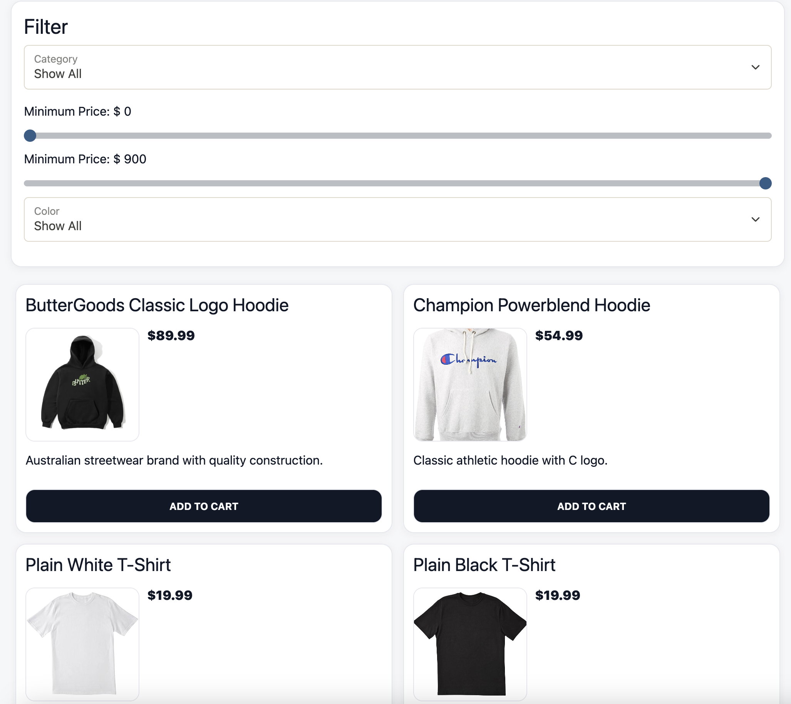

# 👕 Clothing Store – E-Commerce API


## 📌 Overview
This project is a **Spring Boot–based E-Commerce REST API** developed as **Capstone 3** for the Year Up United Software Engineering pathway.

The API powers a **Clothing Store web application**, allowing users to:
- Browse products by category
- Search and filter products
- Authenticate using JWT
- Manage a persistent shopping cart
- Perform admin-level product and category management

The front-end application is prebuilt; all development and enhancements were completed on the **backend API**.

---

## 🧱 Architecture
- **Backend:** Spring Boot (REST API)
- **Database:** MySQL
- **Authentication:** JWT (JSON Web Tokens)
- **Data Access:** DAO Pattern
- **Testing:** Postman / Insomnia

---

## 🚀 Features

### 👤 Authentication
- User registration and login
- JWT token-based authorization
- Role-based access control (ADMIN vs USER)

### 🛍️ Product Management
- Browse all products
- Filter products by:
    - Category
    - Subcategory
    - Price range
- View single product details
- Admin-only:
    - Create products
    - Update products (bug-fixed)
    - Delete products

### 📂 Category Management
- View all categories
- View category by ID
- Admin-only:
    - Create categories
    - Update categories
    - Delete categories
 
  ### 👤 Profile 
- View the credentials of the logged in user 
- Allow the logged in user to update their profile


### 🐞 Bug Fixes Implemented
- Fixed incorrect product filtering logic
- Resolved product duplication bug during updates
- Improved DAO query accuracy

---

## ⚙️ Setup Instructions

### 1️⃣ Clone the Repository
```bash
git clone https://github.com/Phannul/capstone-3.git
```
### 2️⃣ Open the Project 
- InteliJ IDEA (recommended)
- used **JDK 17+**

### 3️⃣Database Setup
- Open **MySQL Wrokbench**
- **Run** create_database.sql

### 4️⃣ Run the Spring Application 

### 5️⃣ Test with Insomnia 

# 📸 Screenshot 

## Home


## Profile

(


